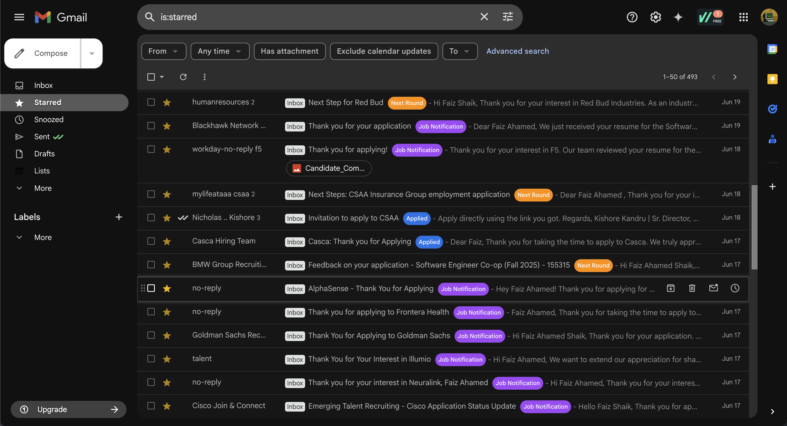
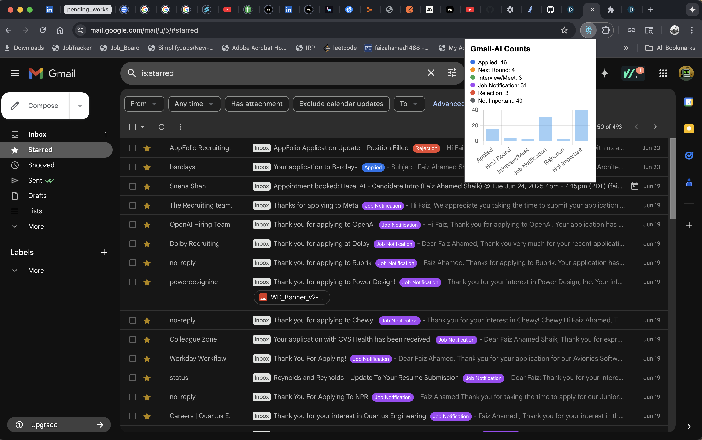

# Gmail AI Classifier Chrome Extension

This Chrome Extension connects to Gmail, reads visible emails, and classifies them using AI (to be added). It displays labels directly inside Gmail’s UI.

## Features

- Injects classification labels
- Future support for OpenAI/Claude classification

## To Do

- Connect Gmail API
- Integrate AI model
- Display smart labels

---

## Setup Instructions

1. Clone the repo
2. Go to `chrome://extensions/`
3. Enable Developer Mode
4. Load unpacked → Select project folder
5. Visit Gmail and watch labels appear!

---
## Output
### Email Classification:

### Email Classification with Dashboard (Early Glance)

